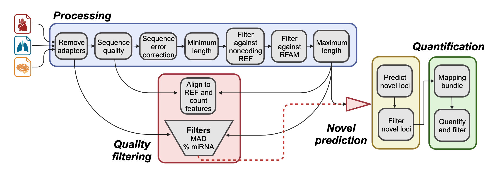

# FARmiR: Framework for Analysis and Refinement of miRNA profiles

FARmiR is a Snakemake-based pipeline for processing and analyzing miRNAs/isomiRs from small RNA sequencing data. It includes steps for quality control, adapter prediction and trimming, annotation and quantification with [isoMiRmap](https://github.com/TJU-CMC-Org/isoMiRmap), evaluation of miRNA candidates using non-coding RNA databases and expression thresholds, and refinement of miRNA profiles. The workflow supports high-performance computing environments with Slurm integration and provides structured outputs for downstream analysis and visuazliation with [AIMEE](https://github.com/jonahcullen/AIMEE).

<p align="center">
  
</p>

## Dependencies

- [Python](https://www.python.org/)
- [Mamba](https://github.com/mamba-org/mamba)
- [Snakemake](https://snakemake.readthedocs.io/)
- [Snakemake-Profiles](https://github.com/Snakemake-Profiles)
- [Apptainer/Singularity](https://apptainer.org/)

## Initial setup

**1. Install dependencies**

If you do not have `conda` already installed, the Snakemake developers **recommend** to install via [Mambaforge](https://github.com/conda-forge/miniforge#mambaforge).

**NOTE:** *In January of 2024, Snakamake underwent a major update to version 8 which introduced a number of breaking changes. Until these are addressed, we suggest using version 7 which can be specified using version number as below.*

```
# download Mambaforge installer (assuming Unix-like platform)
wget "https://github.com/conda-forge/miniforge/releases/latest/download/Mambaforge-$(uname)-$(uname -m).sh"
bash Mambaforge-$(uname)-$(uname -m).sh

# updata Mamba
mamba update mamba -c conda-forge

# create a Snakemake environment which includes all Snakemake dependencies in
# addition to the miscellaneous modules above
mamba create \
    -c conda-forge -c bioconda \
    -n snakem \ # name of the environment
    python=3.10 snakemake=7.19
```

Alternatively, if you are already familiar with `conda` and creating environments, it is suggested to install `mamba` in your base environment and use that to build your environment.

```
# install mamba
conda install -n base -c conda-forge mamba

# create a Snakemake environment
mamba create \
    -c conda-forge -c bioconda \
    -n snakemake \ # name of the environment
    python=3.10 snakemake=7.19
```

**2. Download the container**

```
wget https://s3.msi.umn.edu/se-smallseq/public/sif/hoof.sif
```
This should take ~5 minutes.

**3. Clone this repo**

```
git clone git@github.com:jonahcullen/FARmiR.git
cd FARmiR
```

## Input files
**1. Copy and edit the config file**

```
cp config/config.yaml.template config/config.yaml
```

Then open `config/config.yaml` and update
- Update the path to the container under the `sif:` field

```
sif: /absolute/path/to/hoof.sif
```

- The path to your sample sheet

```
samples: /absolute/path/to/samples.tsv
```

By default, FARmiR is set up for
- Single- or paired-end small RNA-seq
- The EquCab3 reference genome from Ensembl realease 103

These can be modified but doing so may require changes to how the workflow handles alignment, annotation parsing, and additional processing steps.

> 💡 **Need a different genome or annotation (e.g., the upcoming Equine T2T assembly)?**
> Please [open an issue](https://github.com/jonahcullen/FARmiR/issues/new) or [start a discussion](https://github.com/jonahcullen/FARmiR/discussions) — I’m happy to help guide integration of new references!

**2. Prepare a sample sheet**
You `samples.tsv` should be a tab-delimited file with (at minimum) the follwoing columns
```
sample	tissue	year	layout	fastq_1
H001	lamina	2024	single	/absolute/path/to/H001_lamina_R1_001.fastq.gz
```
> Esnure the `layout` column is set to `single` or `paired`

## Usage

Add info about pulling all public data from secondary.

```
DATA_DIR=/path/to/data/dir

snakemake -s small_hoof.smk \
    --use-singularity \
    --singularity-args "-B $PWD,$DATA_DIR" \
    --profile profile/slurm.farmir \
    --configfile config/config.yaml \
    --rerun-triggers mtime
``` 
